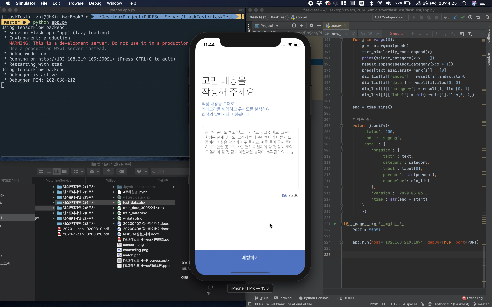
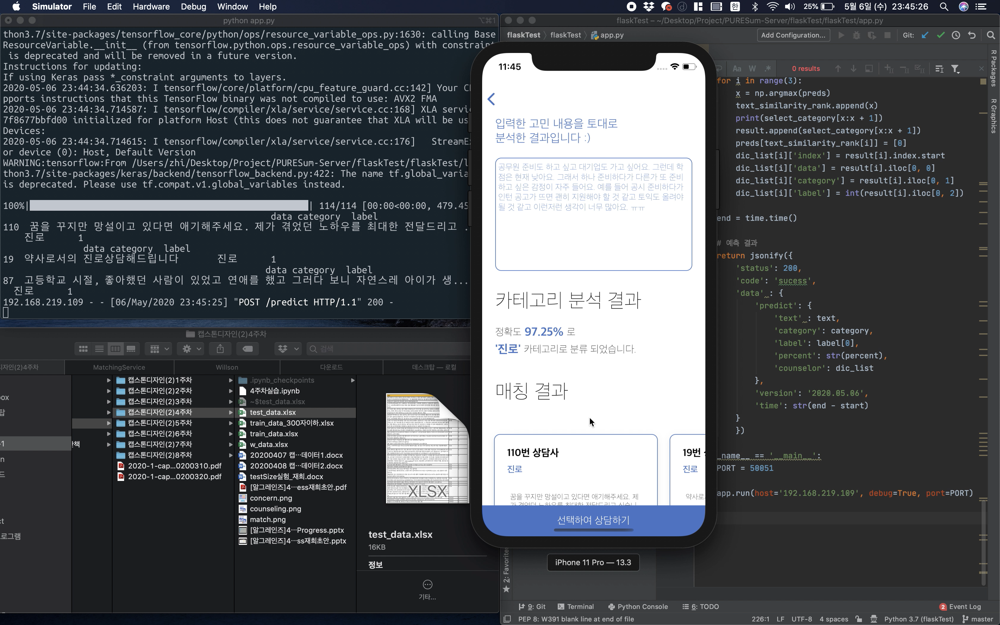

# PURESum-Server

2020-05-06

## [Demo]
#### 실행 화면
<p align="center">
<br><br>

</p>
<br>

#### response model
```json
{
  "code": "sucess",
  "data": {
    "predict": {
      "category": "진로",
      "counselor": [
        {
          "category": "진로",
          "data": "취준기간에 사랑하던 사람이 바람을 피고 울면서 면접을 보러갔던 경험도 있습니다. ",
          "index": 13,
          "label": 1
        },
        {
          "category": "진로",
          "data": "꿈을 꾸지만 망설이고 있다면 애기해주세요. 제가 겪었던 노하우를 최대한 전달드리고 싶습니다.",
          "index": 110,
          "label": 1
        },
        {
          "category": "진로",
          "data": "약사로서의 진로상담해드립니다",
          "index": 19,
          "label": 1
        }
      ],
      "label": 1,
      "percent": "97.19",
      "text": "컴퓨터공학 전공을 살려서 취업을 해야 할지 아님 제가 정말 하고 싶은 걸 해야 할지 모르겠어요."
    },
    "time": "61.73097085952759",
    "version": "2020.05.06"
  },
  "status": 200
}
```

약 1분 정도 시간이 소요된다.
-> 시간 개선이 필요함